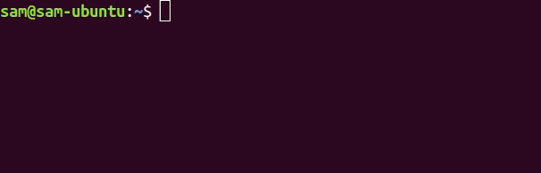

# cleos-auto-completion

<br/><br/>

Because of the limit of CLI11(commandline parser for c++) used by cleos, currently cleos do not provide command auto-complete functionality.
With this project, you can use command auto-completion feature to your cleos. Also, you can use this for your custom cleos shell files with simple changes(which is described below).

For now, We only support BASH. But others will be supported soon.
<br/><br/>


## Installation
Just clone this repo and append source command line inside of your environment file. To make it work immediately, execute source command or restart your bash shell.
```bash
$ git clone https://github.com/Hexlant/cleos-auto-completion.git
$ cd cleos-auto-completion
$ echo "source $(pwd)/cleos.bash" >> ~/.bashrc

(for immediate working..)
$ source $(pwd)/cleos.bash
```
<br/><br/>


## Customization
### for custom cleos shell files
If you're using your own cloes shell file, add your file names at $CLEOS_TARGET_NAME before installation step. You can find this at line 10.
```bash
(BEFORE)
CLEOS_TARGET_NAME=(cleos)

(AFTER)
CLEOS_TARGET_NAME=(cleos_local.sh cleos_mainnet.sh)
```
<br/><br/>


## Contribution
We always welcome contributions. Feel free to make pull request or report issues!
